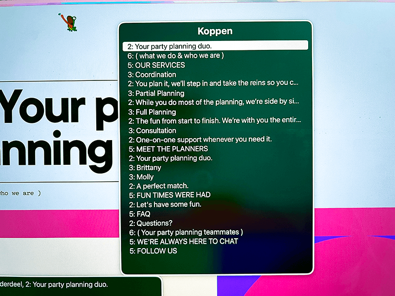
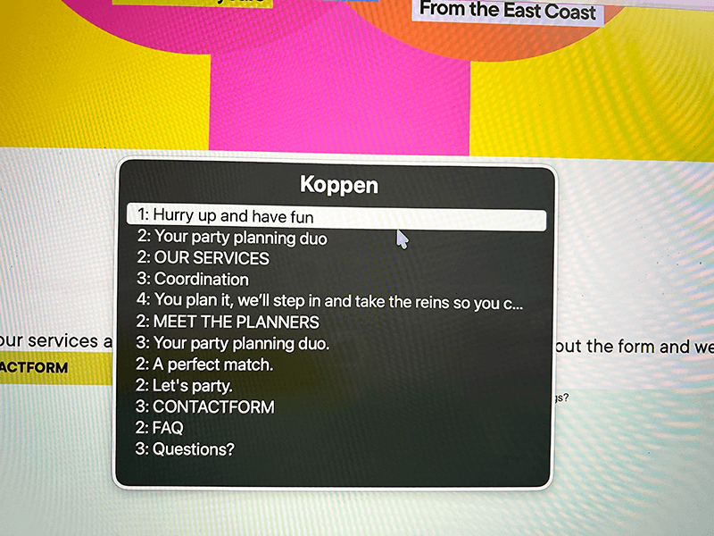
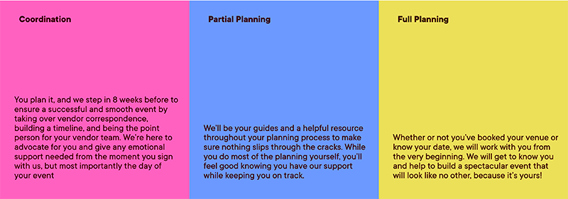
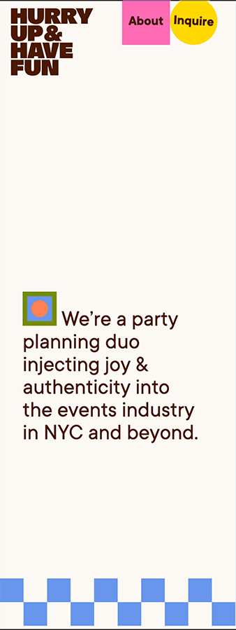
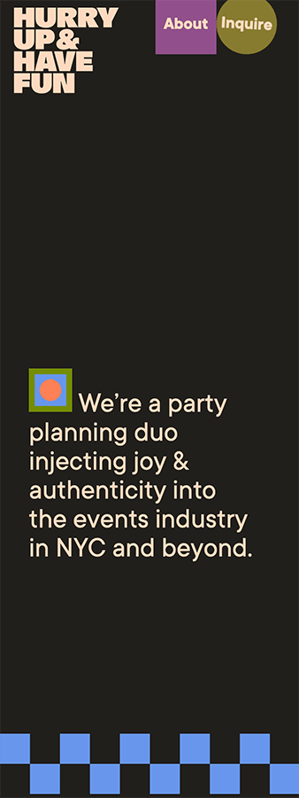
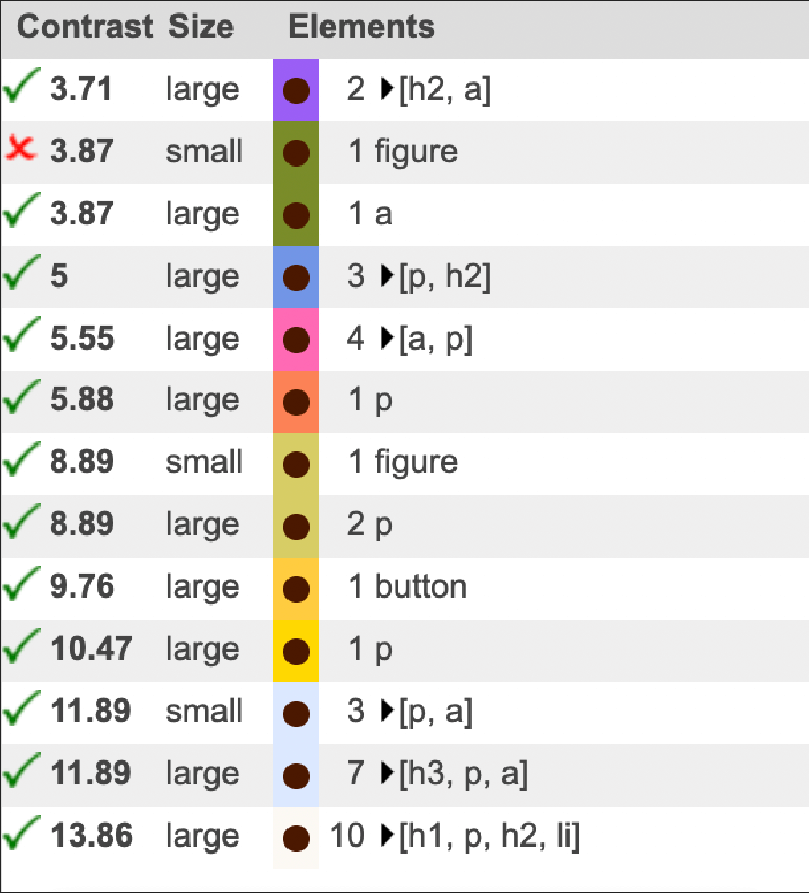

# Procesverslag
Markdown is een simpele manier om HTML te schrijven.  
Markdown cheat cheet: [Hulp bij het schrijven van Markdown](https://github.com/adam-p/markdown-here/wiki/Markdown-Cheatsheet).

Nb. De standaardstructuur en de spartaanse opmaak van de README.md zijn helemaal prima. Het gaat om de inhoud van je procesverslag. Besteedt de tijd voor pracht en praal aan je website.

Nb. Door *open* toe te voegen aan een *details* element kun je deze standaard open zetten. Fijn om dat steeds voor de relevante stuk(ken) te doen.

Link naar website: https://maaikeschoute.github.io/02FED_herkansing/

## Jij

  
uitwerken voor kick-off werkgroep

  ### Auteur:
  Maaike Schoute

  #### Je startniveau:
  Rood

  #### Je focus:
  Plane

## Je website

  
uitwerken voor kick-off werkgroep

  ### Je opdracht:
  https://phamilypharma.com/concept
  of: https://www.hurryupandhavefun.com/

  #### Screenshot(s) van de eerste pagina (small screen):
  Homepage
  

  #### Screenshot(s) van de tweede pagina (small screen):
  hier de naam van de pagina  
  

## Toegankelijkheidstest 1/2 (week 1)

  
uitwerken na test in 2e werkgroep

  ### Bevindingen 
  Op deze site kun je alleen de heading horen, en de linkjes. Niets te horen van de headings, of pharagraph texten. Je kan alleen op de links klikken. Het is wel duidelijk waar de link naartoe gaat. Want dat is beschreven in de knop of link. Alleen iets minder duidelijk als je op 'details' klikt. Dat is een uitklap venster, bij een bepaald onderdeel.  Maar als je de koppen niet kan horen, dan weet je ook niet wat voor details je te zien krijgt. In dit geval niets, want je kan alleen met tab naar de knoppen.   

  <b>Content</b> 
  Ja | Het is duidelijke tekst zonder lastige spreekwoorden, of gecompliciseerde metaforen. 
  Ja | De knoppen zijn duidelijk beschreven, met duidelijk labels, en unieke beschrijving.  

  <b>Global Code</b> 
  Ja | De errors die er zijn, zijn er van de "Dupilicate ID", "A bad value" en "Div's". Div's staan meestal in de buttons.  
  Ja | Heeft een Lang attribute.  
  Ja | Elke pagina heeft een eigen titel. 
  Ja | vieport zoom werkt.  

 <b>Keyboard</b> 
 Ja | je ziet een tab randje, bij de elementen die hebt geselecteerd met je keyboard. 
 Ja | Alle elementen geselecteerd met de tab worden op volgorde van boven naar beneden, en beneden naar boven van de pagina selecteerd.  

 <b>Mobile and Touch</b> 
 Nee | Wanneer de mobiel roteerd, dan gaan texten met elkaar overlappen, waardoor de site niet meer leesbaar is. 
 Ja | Je kan niet horizontaal scrollen. 
 Ja | Knoppen en links kunnen makkelijk worden geklikt. 
 Ja | Er zit genoeg ruimte tussen alle interactieve elementen tijdens het scrollen.  

 <b>Headings</b> 
 
Ja | De home pagina heeft geen H1. Wel 3 h2's en h3's, 4 h5's, en 2 h6. 
 
De About pagina heeft  0 h1, 12 h2's, 15 h3's, 7 h5's en 2 h6's. 
Nee | Er zijn geen H1's. 
Ja | Headings hebben logische volgorde: 
 
 
Nee | Er zijn wel headinglevels geskipt. De H4.   

<b>Lists</b> 
Er wordt geen gebruik gemaakt van li elementen.  

<b>Images</b> 
 
Nee | De website bestaat vooral uit SVG's. Deze afbeeldingen hebben vaak dezelfde (lange 12345234) namen, en zijn niet goed toegankelijk voor slechtziende mensen die met Tab navigeren door de website. 
 
Hetzelfde geld voor de homepage.  
Nee | De alt in decoratieve images gebruiken geen "0" value. 
 
Nee | Er zijn geen alt texten, in afbeeldingen waar misschien meer uitleg voor zou moeten zijn.  

<b>Media</b> 
This site has no media.  

<b>Controls</b> 
 
Ja | De site gebruikt <a hrf=src(#)>a</a> elementen bij links. 
Ja | De links zien eruit als buttons en staan in de nav. 
Ja | De links scrollen mee met de pagina. Maar ze brengen je niet met een sneltoets mee terug naar begin pagina, of laten een layout zien van de verschillende hoofdstukken, waar je naar terug wilt springen. 
 
Ja | De controls hebben focus state. 
 
Ja | Als de control is geselecteerd, dan klapt hij het uitklap menu uit. Anders laat hij hem dicht.  
Ja | Alleen in de NAV ga je naar een andere pagina.  

<b>Appearance</b> 
Nee | Er is geen dark mode. Alleen een light mode. 
Nee | De site ziet er niet anders uit als het verhoogde contrast in ingesteld.  
Nee | Ik kan wel inzoomen en uitzoomen op de pagina, maar ik kan niet met ctrl + de lettertypen groter maken. 
Ja | Ook zonder kleur is het duidelijk waar de website over gaat.  

<b>Animation</b> 
Ja | De animaties zijn subtiel, en trekken niet teveel de aandacht. 
Nee | Er is geen video, dus ook geen pauze knop voor een video. 
Nee | De afbeeldingen blijven van kleur veranderen als je "Verminder Beweging" inschakeld in "toegankelijkheid".  

<b>Color contrast</b> 
 
 
 
Nee | Op de meeste plaatsen is er een goed verschil tussen de kleuren. Maar niet overal is goed het verschil te zien tussen wit, en beige bijvoorbeeld. Voor teksten is deze wel altijd goed te onderscheiden, maar voor de iconen niet. Zelf vind ik op deze afbeelding:  
 
De tekst in het midden niet erg duidelijk contrasterend met de achtergrond.  
Nee | Er is geen :: Selection colors? Niet gevonden ieg.  

<b>Samenvatting:</b> 
  • | De errors die er zijn, zijn er van de "Dupilicate ID", "A bad value" en "Div's". Div's staan meestal in de buttons.  
  • | De home pagina heeft geen H1. Wel 3 h2's en h3's, 4 h5's, en 2 h6.  
  • | Er worden ook H's geskipt in de volgorde van de pagina. H4 komt bijvoorbeeld helemaal niet voor. 
  • | Er wordt geen gebruik gemaakt van li elementen op locaties waar dat wel kan, of een betere oplossing kan zijn. 
  • | De website bestaat voor een groot deel uit SVG's. Deze afbeeldingen hebben vaak dezelfde (lange 12345234) namen, en zijn niet goed toegankelijk voor slechtziende mensen die met Tab navigeren door de website. 
  • | De alt in decoratieve images gebruiken geen "0" value. 
  • | Er zijn geen alt teksten, in afbeeldingen waar misschien meer uitleg voor zou moeten zijn. 
  • | Er is geen dark mode. Alleen een light mode. 
  • | De site ziet er niet anders uit als het verhoogde contrast in ingesteld.  
  • | Ik kan wel inzoomen en uitzoomen op de pagina, maar ik kan niet met ctrl + de lettertypen groter maken. 
  • | De afbeeldingen blijven van kleur veranderen als je "Verminder Beweging" inschakeld in "toegankelijkheid". 
  • | Op de meeste plaatsen is er een goed verschil tussen de kleuren. Maar niet overal is goed het verschil te zien tussen wit, en beige bijvoorbeeld. Voor teksten is deze wel (bijna) altijd goed te onderscheiden. 
  • | maar voor de iconen (logo achtergong, ronding van -> knoppen) niet. 
  • | Er is geen :: Selection colors? Niet gevonden ieg. 

## Breakdownschets (week 1)

  
uitwerken na afloop 3e werkgroep

  ### de hele pagina:
  

  ### dynamisch deel (bijv menu):
  

<b>Vragen</b>
• | Op de homepage staan alle h's in volgorde van H2 naar H6. Maar als ik dezelfde H stijlen gebruik bij de About pagina, dan staan de h's niet meer op volgorde. Moet je dan 2 verschillende style sheets maken? 
• | het is ook lastiger om de kopjes vorm te geven, gezien h6:nth(1) { } niet dezelfde kleur heeft op de home page als op de about page. Hoe kan ik dit oplossen? 
• | Ik heb ook een aantal div's.... Omdat er was 'decoratie figuren' in het ontwerp zitten. moet ik die veranderen naar svg's? Zodat de div's weg gaan? En graag nog een x de uitleg wanneer secties, en div's te gebruiken :D. 
• | Hoe noem je zo'n uitschuif menu?

  

## Voortgang 1 (week 2)

  
uitwerken voor 1e voortgang

  ### Stand van zaken
  hier dit ging goed & dit was lastig (neem ook screenshots op van delen van je website en code)

  ### Agenda voor meeting
  samen met je groepje opstellen

  | Robin                | Safea              | Zhafira           | Maaike           |
  | ---                  | ---                | ---               | ---              |
  | websitestructuur     | websitestructuur   | websitestructuur  | wanneer div's    |
  | nav                  | ....               | carosel           | wanneer sectoren |
  | html                 | ...                | producviewer      | websitestructuur |

  <b>Robin</b>
  - gebruik een echte SVG tag. let erop dat je alles netjes nest. 
  - Bij het gebruikt van een section, moet een heading. Je mag wel sections gebruiken.
  - je mag niet veel sections in eeen section stoppen.

  <b>Xar</b>
  - Je kan een nav in je footer plaatsen. Youtube.

  <b>Maaike</b>
  - Id voor de body van pagina 2. En daarin de headings anders aanspreken.
  headings zijn alleen voor belangijke section. Alles wat daarin hoort, wordt georganiseerd in headings, dus belangrijkste h2, dan 3.etc
  - GEEN DIV. Gebruikt de svg;s. Als je dingen wilt boxen, gebruik dan figure. = voor figuren, video;s, beelden. geen p's, mag wel een fig caption.
  - uitschuif menu heet een detial.
  - ff je eigen linkje in de excel zetten.  - check

  <b>Zhafira</b>
  - iets met labels.

  ### Verslag van meeting
  hier na afloop snel de uitkomsten van de meeting vastleggen

  - SVG's kun je gewoon van de orginele site kopieren van de inspector, en plakken in je eigen code. Het klopt dat deze er elke keer heel anders uitziet.
  - Je kan een #id pagina2 en daarin alle H's en andere vormgeving die aangepast moet worden aanpassen
  - maak de html pagina's.

## Voortgang 2 (week 3)

  
uitwerken voor 2e voortgang

  ### Stand van zaken
  Deze keer was ik bezig met het maken van mijn CSS. Het duurde me veelste lang om erachter te komen hoe ik de typografie moest downloaden van de site hurryupanhavefun.com. Nadat ik ze dinsdag 30 sepember had gedowload na een demonstratie van 1 seconde, was het nog lastig uit te zoeken welk lettertype ik had gedownload. Ze hadden namen als 01GDJG13423jgd^&8.tt. Daar maakte ik een test document, om te kijken welke fonts het waren. 
 
  
 Ook had ik twijfels welke volgorde ik de h2's en h3's moetst doen. Maar Sanne zei dat het al goed was dat ik hier overnadacht, en dat het in prince niet veel uitmaakte, zolang ik kon vertellen waarom ik de keuze had gemaakt.   

<b>WAT GEDAAN</b>
 - Meerder stylesheets.css gemaakt. 1 voor font faces. 1 om alle headings, p's etc aan te passen. 1 voor alle kleuren. 1 voor all het andere. 
 - Heel veel dingen mislukt enzo.  

 <b>VRAGEN</b>
 - moeten de SVG's in in het mapje bij je img staan? Of hoeft dat niet omdat ze in code al in de html staan?  
 - Hoe kan ik die blauwe blokjes in header niet meer in een margin hebben? Moet ik het dan uit de header halen? En een soort 'zwevend' ding van maken? (tussen de <header> en <main> in). Of is daar een andere code voor? 
 - vragen hoe ik de NAV goed krijg. (1. Hoe ze aan de linkerkant komen te staan. 3. Iets met flexbox, en dat ze sticky blijven in de top). 
 - Nog een keer vragen welke code/welke site/promp op te zoeken om dat rondje met scrollen te laten draaien.  
 - Waarom neemt de <main> niet de hele breedte in beslag, maar lijkt het alsof er een margin omheen zit? 

  ### Agenda voor meeting
  samen met je groepje opstellen

  | Safae      | Zhafira                | Maaike              | Robin        |
  | ---        | ---                    | ---                 | ---          |
  | classes    | Automatische carousel  | Flexbox             | Nog niet ver |
  | sections   | Hoe met javascript     | handig css indelen | Geen vragen  |
  | articles   | ...                    | ...                 | ...          |

  <b>Robin</b> 
  Niet aan de SVG viewport komen. Je kan css gewoon als svg aanspreken in de css. 

  <b>Maaike</b> 
  - gebruik top, right, bij de verschillende elementen.
  - svg's kun je laten staan, maar hoeft niet in een mapje te staan. Is wel handig om een map te hebben waar ze allemaal staan. 

  <b>Zhafira</b> 
  Moest een nav tussen bij javascript. 

  ### Verslag van meeting
  Uitleg gekregen over Hoe een carosel te maken. + uitleg gekregen waar ronddraai ding te maken/vinden voor in mijn nav.

## Voortgang 2 (week 4)

  
uitwerken voor 3e voortgang

  ### Stand van zaken
  Deze week was ik aan het stoeien met GRID, en het sticky maken van de nav. Ook om 'Inquieries' rond te laten draaien en om een slideshow te maken. De homepage is bijna af! Zo blij!  Als ik die punten nog aanpak, en de footer afmaak, dan is de homapage klaar. En dan beginnen we met de moeilijke pagina... de ABOUT pagina. Daarin heb ik twee hele lastige stukjes. Eentje met veel animaties (als ik tijd over heb, maak ik deze), en eentje met een invulformelier, dat een stappen plan laat zien. Hier heb ik denk ik wel extra hulp bij nodig.  

<b>WAT GEDAAN</b>
 - pagina 1 proberen af te krijgen.  
 - leren hoe top en sticky in nav werken.  

 <b>VRAGEN</b>
 - Kunt u nog een keer uitleggen hoe je forums maakt, en hoe je dit kunt maken, met een 'volgende' knop. Of dat dit alleen werkt bij met Javascript.  

  ### Agenda voor meeting
  samen met je groepje opstellen

  | Safae                 | Zhafira         | Maaike        | Robin        |
  | ---                   | ---             | ---           | ---          |
  | Velden en buttons     | positioneren    | Forms         | ...           |
  | Plaatjes achter tekst | background img  | Javascript    | ...           |
  | screen reader         | ...             | br gebruikt waar het niet mag :D           | ...          |

  <b>Robin</b> 
  Niet aan de SVG viewport komen. Je kan css gewoon als svg aanspreken in de css. 

  <b>Zhafira</b> 
...

  <b>Safea</b> 
  Hoe koppel je een input aan een button? 
  Ipv button, submit. 
  < label > input: submit.  Je kan ze samen in een form zetten. 
 
 <b>Maaike</b> 
 Hoe moet ik de form werkend maken?  
 Met if else states. Javascript. Display and display none. 
 max width aan de h2 geven, zodat hij vanzelf afbreekt en geen br nodig is. 
 max heigth bij seection 2, om Meet your planners lager te zetten op de p tekst eronder.

  ### Verslag van meeting
  hier na afloop snel de uitkomsten van de meeting vastleggen

  - Als je de grootte van een svg wilt aanpassen, moet deze waardes uit de svg die in de html staan weghalen. Maar kom niet aan de viewport. Dan gaat hij kapot.
  - Om een form te maken, waarbij je na het invullen naar de volgende pagina gaat, maak je gebruik van javascript. Je gebuikt ook de hide elementen. (later hoorde ik van Sanne dat ik deze niet helemaal hoef uit te werken).
  - Een h2, heb ik afbroken met een  . Ik weet dat dit niet mag, dus hoe kan het anders? Het kan anders door de tekst een maximale width te geven in de css. Dan breekt de tekst zich vanzelf af op het punt dat je wilt.

## Toegankelijkheidstest 2/2 (week 4)

  
uitwerken na test in 9e werkgroep

  ### Bevindingen
  Vorige keer waren dit de punten die verbetered moetsten worden in de website: 

  <b>OUD -> Punten om te verbeteren</b> 
  <b>Global code</b> 
  • | De errors die er zijn, zijn er van de "Dupilicate ID", "A bad value" en "Div's". Div's staan meestal in de buttons.  

  <b>Headings</b> 
  • | De home pagina heeft geen H1. Wel 3 h2's en h3's, 4 h5's, en 2 h6.  
  • | Er worden ook H's geskipt in de volgorde van de pagina. H4 komt bijvoorbeeld helemaal niet voor.  

  <b>Lists</b> 
  • | Er wordt geen gebruik gemaakt van li elementen op locaties waar dat wel kan, of een betere oplossing kan zijn. 

  <b>Images</b> 
  • | De website bestaat voor een groot deel uit SVG's. Deze afbeeldingen hebben vaak dezelfde (lange 12345234) namen, en zijn niet goed toegankelijk voor slechtziende mensen die met Tab navigeren door de website. 
  • | De alt in decoratieve images gebruiken geen "0" value. 
  • | Er zijn geen alt teksten, in afbeeldingen waar misschien meer uitleg voor zou moeten zijn. 

  <b>Appearance</b> 
  • | Er is geen dark mode. Alleen een light mode. 
  • | De site ziet er niet anders uit als het verhoogde contrast in ingesteld.  
  • | Ik kan wel inzoomen en uitzoomen op de pagina, maar ik kan niet met ctrl + de lettertypen groter maken.  

  <b>Animation</b> 
  • | De afbeeldingen blijven van kleur veranderen als je "Verminder Beweging" inschakeld in "toegankelijkheid". 

<b>Color contrast</b> 
  • | Op de meeste plaatsen is er een goed verschil tussen de kleuren. Maar niet overal is goed het verschil te zien tussen wit, en beige bijvoorbeeld. Voor teksten is deze wel (bijna) altijd goed te onderscheiden. 
  • | maar voor de iconen (logo achtergong, ronding van -> knoppen) niet. 
  • | Er is geen :: Selection colors? Niet gevonden ieg. 

   ### Verbeteringen:
  <b>NIEUW -> Verbeterde versie</b> 
  <b>Global code</b> 
  • | Er zijn 2 DIV's gebruikt. Deze zijn als decoratie. Verder zijn er geen DIV's meer. 

  <b>Headings</b> 
  De headings zijn aangepast. Elke pagina heeft 1 H1. En elke sectie begint met een H2, enzo lager.  
  Headings originele site:  
   
  Headings verbeterde site  
   
   De H's staan nu in goede volgorde, en er zijn ook maar 4, ipv 6. In de oude vesie miste ook een h4, maar werd er wel verder geteld naar h6.

   <b>Lists</b> 
   • | Er is nu wel gebruikt gemaakt van list elementen bij elementen die bijelkaar horen. 
    

   <b>Images</b> 
  • | Er zijn nog steeds SVG's gebruikt, maar ze hebben een korte naam gekregen. Een naam geven aan de svg maakt niet uit. Elke SVG heeft zijn eigen, enorm lange code. Dit hoort bij SVG's. Het is ook niet erg dat ze niet met TAB's kunnen worden geselcteerd, want zijn er alleen als decoratie.
  •c SVG's hebben geen alt teksten nodig. In de png afbeeldingen zijn wel alt teksten toegevoegd, die kort vertellen wat er op de afbeelding te zien is.
  • | Verder zijn er geen decoratieve images gebruikt. 

  <b>Appearance</b> 
  • | Darkmode is toegevoegd. 
  
   
  • | Je kan nu inzoomen met command +   

  <b>Animation</b> 
  • | De animaties zijn weggehaald. Alleen nog bij de hover bij de NAV staan ze aan op disco modus. Dit ziet er leuk uit, maar is wel een beetje heftig als je epilepsie hebt. Daarom zou ik het voor volgde keer gewoon 1 kleur houden, zodat het niet teveel prikkels geeft. Voor nu laat ik het staan, om te laten zien dat ik iets met animatie heb gedaan.   

  <b>Color contrast</b> 
  • | De color contrassen zijn verbeterd. Er staat nog een fout in, maar het klop hier, dat er voor de achterkleur 2 dezelfde kleuren zijn gebruikt.  
  <b>Orginele site</b> 
  
  <b>Verbeterde site</b> 
   <b>

## Voortgang 3 (week 4)

  
uitwerken voor 3e voortgang

  ### Stand van zaken
  Ik heb de site bijna klaar! In de eerste weken vond ik het heel lastig om grid te leren. En nog steeds zijn er momenten dat ik niet snap, waarom het niet werkt. Maar heb er nu wel een veel beter begrip van dan eerst! Javasript blijft voor mij een mysterie. Als ik dat wil leren, dan ik zou daar meer tijd in moeten stoppen, omdat ik ook veel ben vergeten van vorig jaar. Het is ook lastig dat internet vaak "makkelijke" voorbeelden geeft, die niet goed aansluiten op de stof die we hebben behandeld. 

  Wat ik nog steeds niet begrijp, is waarom mijn nav niet werkt op de index pagina. Met Mila en Sanne hebben we daar meerdere keren naar gekeken. En in de inspector op de browser dingen aangepast. (door bijvoorbeeld position:fixed; te geven), maar het wilt maar niet lukken! Op de about pagina had ik deze problemen absoluut niet, en werkte het meteen goed. 

  Deze lessen heb ik veel geleerd over symantisch en over selectoren. Dat vond ik voorheen ook niet heel lastig, maar ik weet nu wel het verschil tussen een article en een section, dat Div's alleen gebruikt mogen worden als decoratie, en dat sections helpen om een pagina overzichtelijk te maken, en het makkelijker maken om de vormgeving aan te passen. 

  Wat ik ook lastig vond was dat SVG's vaak een eigen grootte hadden. Deze stond ergens in de enorme SVG code verstopt, en het was een zoekwerk om de widht en height daar te vinden en weg te halen. 

  Elke week heb ik aantekeningen gemaakt in Freeform, een apple app die lijkt op Miro. Daarin staan ook nog aantekeningen van tabel, en de formums. In deze website heb ik alleen de forms gebruikt.

  Ook heb ik alle afbeelding in deze readme, en in op de site, getinyfied met de site: tinypng.com. Dit zodat de site snel kan laden, en het weinig energie kost om op de site te komen.

  Wat nog beter kan, is dat de css code waarschijnlijk nog korter kan wordern geschreven. Volgende keer zou ik daar beter naar kijken. Dit was ook de eerste keer dat ik gebruik maakte van verschillende css documenten. Meestal schreef ik alles in 1 css document, maar ik vind het eigenlijk wel fijn dat je alles kan organiseren met verschillende stylesheets. De indeling kan ook iets handiger, maar ik was al zo ver, dat het me een halve dat zou duren om alles goed te organiseren. 

  ### Agenda voor meeting
  samen met je groepje opstellen

  | student 1      | student 2          | student 3    | student 4        |
  | ---            | ---                | ---          | ---              |
  | dit bespreken  | en dit             | en ik dit    | en dan ik dat    |
  | en dat ook nog | dit als er tijd is | nog een punt | dit wil ik zeker |
  | ...            | ...                | ...          | ...              |

  ### Verslag van meeting
  hier na afloop snel de uitkomsten van de meeting vastleggen

  - punt 1
  - punt 2
  - nog een punt
  - ...

## Eindgesprek (week 5)

  
uitwerken voor eindgesprek

  ### Je uitkomst - karakteristiek screenshots:
  

  ### Dit ging goed/Heb ik geleerd:
  Korte omschrijving met plaatjes

  

  ### Dit was lastig/Is niet gelukt:
  Korte omschrijving met plaatjes

  

## Bronnenlijst

  
continu bijhouden terwijl je werkt

  Nb. Wees specifiek ('css-tricks' als bron is bijv. niet specifiek genoeg).
  Nb. ChatGpT en andere AI horen er ook bij.
  Nb. Vermeld de bronnen ook in je code.

  1. [BRON](https://www.seoreviewtools.com/html-headings-checker/) - het checken van de headings op de webpagina.
  2. [BRON](https://ralfvanveen.com/en/tools/alt-attribute-checker/) Alt checker website
  3. [BRON]SVG export - Google Chrome extentie om SVG's van een webpagina te scrapen.
  4. [BRON] Hoe maak je een form?: https://www.google.com/search?q=hoe+maak+je+unvul+form+html&sca_esv=f04038ad81816743&sxsrf=AE3TifN4i9sADXbdX9Vx2Jl7qCX_S6ff_A%3A1758367077756&ei=ZY3OaJzpLYzq7_UPgZCVoQo&ved=0ahUKEwjcr7fom-ePAxUM9bsIHQFIJaQQ4dUDCBA&uact=5&oq=hoe+maak+je+unvul+form+html&gs_lp=Egxnd3Mtd2l6LXNlcnAiG2hvZSBtYWFrIGplIHVudnVsIGZvcm0gaHRtbDIIEAAYgAQYogQyBRAAGO8FMgUQABjvBTIFEAAY7wUyBRAAGO8FSIgtUK8EWIUrcAR4AZABAJgBeKAB9xKqAQQyNS41uAEDyAEA-AEBmAIioALeE6gCEMICBxAjGCcY6gLCAhQQABiABBiRAhi0AhiKBRjqAtgBAcICBBAjGCfCAgsQABiABBiRAhiKBcICChAAGIAEGEMYigXCAgsQLhiABBjRAxjHAcICBRAAGIAEwgIFEC4YgATCAggQLhiABBjUAsICCxAuGIAEGMcBGK8BwgIKECMY8AUYJxjJAsICCBAAGIAEGMsBwgIHEAAYgAQYCsICBhAAGBYYHsICCBAAGAgYDRgewgIHEAAYgAQYDcICCRAAGIAEGBMYDcICCBAAGBMYDRgewgIKEAAYExgIGA0YHsICBRAhGKABwgIHECEYoAEYCsICChAAGAgYChgNGB7CAgsQABiABBiGAxiKBZgDBPEFHL521MX8CMO6BgYIARABGAGSBwQyOC42oAfzxQGyBwQyNC42uAfQE8IHBjUuMjAuOcgHUQ&sclient=gws-wiz-serp
  5. [BRON] Forms uitleg: https://chatgpt.com/share/68cea3ac-1ffc-8009-b70a-63681384af5e
  6. [BRON] min-max grid uitleg en error fix: https://claude.ai/share/c01c7c22-ea94-4deb-b20e-919cce0d731b
  7. [bron] animation nav: https://chatgpt.com/share/68e0eb5e-b7f0-8009-a091-29389efbdb85
  8. [BRON] grid calculator: https://cssgrid-generator.netlify.app/
  9. [BRON] space between letters: https://developer.mozilla.org/en-US/docs/Web/CSS/letter-spacing
  10. [BRON] Carousel https://codepen.io/shooft/pen/myVroQM?editors=1100 

  STYLE_INDEX.CSS
  1. [BRON] EASE IN EASE OUT | https://stackoverflow.com/questions/41267357/css-ease-in-and-out-on-hover
  2. 

  HOMEPAGE_HEADER
  1. [BRON] ROTATE NAV P | https://codepen.io/shooft/pen/bNEooQv?editors=1100

  HOMEPAGE_MAIN.css
  1. [BRON] grid fixen in main: https://claude.ai/share/c01c7c22-ea94-4deb-b20e-919cce0d731b. helpt me met organiseren en korter schrijven (grid start-end) van code
  2. [BRON] https://www.shecodes.io/athena/103773-how-to-uppercase-a-text-on-css#:~:text=To%20uppercase%20text%20in%20CSS,the%20targeted%20element%20to%20uppercase.
  3. [BRON] https://developer.mozilla.org/en-US/docs/Web/CSS/letter-spacing
  4. [BRON] where to align?: https://css-tricks.com/snippets/css/complete-guide-grid/
  5. [BRON] De volgende bronnen zijn gebruikt voor het maken van deze carousel. + Dit was uitgelegd tijdens de feedback rondes. 
  https://developer.chrome.com/blog/carousels-with-css#carousel_gallery 
  https://chrome.dev/carousel-configurator/ 
  https://developer.chrome.com/docs/css-ui/anchor-positioning-api 
  https://chrome.dev/anchor-tool/
  6. [BRON] Vul gehele achtergrond met blokjes | https://claude.ai/public/artifacts/74e4e7a9-c634-4696-87e1-bd1e723bd540 + Code hulp van Sanne
  7. [BRON] Word break, en fix de grid code | https://claude.ai/share/109a203b-3bb1-4d7d-88ee-183f51e32e0e 

  
  ABOUT_HEADER
  1. [BRON] Voorbeeld van Sanne: https://codepen.io/shooft/pen/bNEooQv?editors=1100

  ABOUT_MAIN
  1. [BRON] HOE SPREEK JE DETAILLS ELEMENTEN AAN IN CSS? 1: https://codepen.io/SitePoint/pen/wvNwrwZ
  2. [BRON] HOE SPREEK JE DETAILLS ELEMENTEN AAN IN CSS? 2: https://claude.ai/share/ac86c446-da75-4da5-b7b0-da287616981a

  SCRIPT.JS
  1. [BRON] PROMT: hi chat. Ik heb een website na gemaatk met html en css, en nu moet ik daar nog een javascript element aan toevoegen. Ik weet alleen helemaal niks van javascript. Kun jij me helpen om dit uit te leggen, of mijn naar (gratis) bronnen te sturen er iets meer over kan leren? | 
  https://claude.ai/public/artifacts/3512b5ad-9fb9-4c2c-8b88-6288624ce18c

  
  FOOTER.css
  1. [BRON] CIKELS OP DE BODEM | SANNE'S HULP + https://claude.ai/share/109a203b-3bb1-4d7d-88ee-183f51e32e0e  

